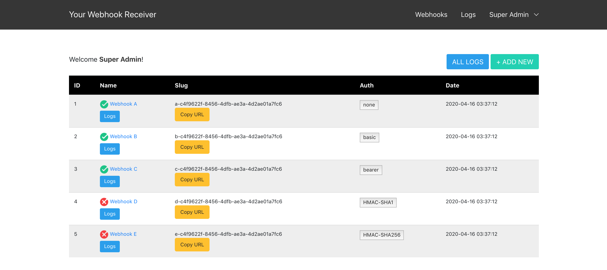
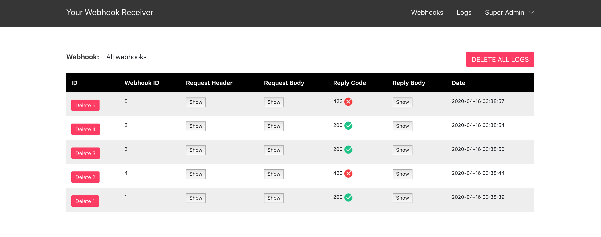
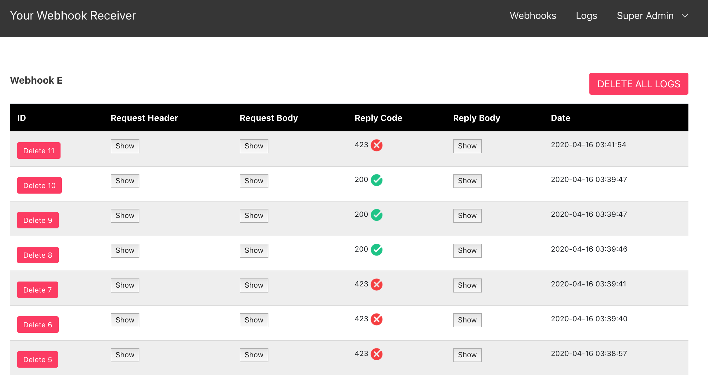

# Your Webhook Receiver Server

Your webhook receiver server to test what is coming like request bin

## Setup

```bash
sudo npm i -g @adonisjs/cli
npm i
adonis migration:run
adonis seed
adonis serve --dev
```

## Demo:

Host: https://your-webhook-receiver.herokuapp.com/

Username: `super@admin.com`

Password: `superadmin`

#### Home screen:



#### Logs:



#### One webhook logs:


